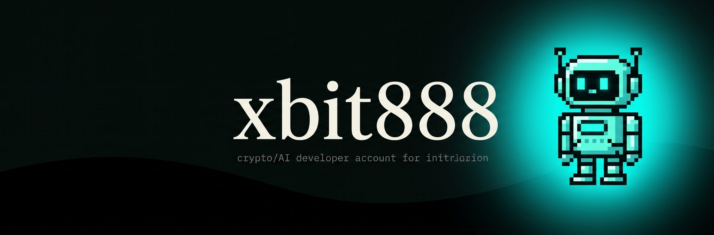

# XBIT888

**Read the tape. Build the tool. Ship it open.**

[](https://x.com/xbit888)
[](https://github.com/xbit888/xbit888)
[](#xbit888--bundle-checker)

### 📟 About me

grok bot developer · [@xbit888](https://x.com/xbit888)

"No wallet, no keys, no execution — just the tape, live."

I build small, single-purpose tools that watch the market instead of trusting someone else's dashboard: contract-address watchers, correlation arbitrage bots, and early-momentum token scanners. Everything runs local, reads public data only, and ships with dry-run first.

**Currently building [XBIT888](#xbit888--bundle-checker): a bundle checker — paste a token address and see which wallets bought the launch together.**

### 🧰 Project stack


### 🛠 What I work on

| Area | What it does |
| --- | --- |
| **Bundle detection** | Find the wallets that bought a launch in the same seconds, then trace them back to the wallet that funded all of them. |
| **Market watchers** | Track live buy/sell flow, MCAP, and price for any token by contract address — no keys, read-only public data. |
| **Arbitrage bots** | Correlate price feeds across exchanges and execute spread trades with fee-aware, auto-sizing logic. |
| **Token discovery** | Scan new pools for early-momentum signals — volume spikes, liquidity growth, anti-scam filters. |
| **Signal content** | Turn the tools and the trades into posts — the process behind the bots, not just the results. |

### 🧬 XBIT888 — bundle checker

**Paste a contract address, see who bundled the launch.** Dark trading-terminal interface, RU / EN / 中文.

- **Bundle analysis is the main screen**: every wallet that bought in the first 60 seconds after the pool opened, with its share of total supply
- Wallets funded from the same source are grouped and highlighted together — that is one operator running many addresses, not organic demand
- Headline numbers spelled out: % of supply taken by linked groups, % bought early overall, wallet count, group count
- **No indexer required** — the pool, the launch block and the token identity are read straight from RPC, so tokens too fresh for Dexscreener (the ones you find on GMGN) still resolve
- Auto-detects the network and data source from the CA alone: Uniswap V4 including Robinhood Chain, DEX pools (Raydium / Orca / Uniswap V2-V3), pump.fun bonding curves
- Live tape underneath: 0.1s polling, gapless 1-second candles, MCAP recalculated on every trade
- Double-click a wallet to copy the address, double-click a trade to open it in the block explorer
- Public, free data sources only — no API keys, no wallet connection, no execution

```bash
python xbit888-boundless.pyw
```

Requires Python 3.10+ — standard library only (`tkinter`). Double-click the file directly if `.pyw` is associated with `pythonw.exe`.

[Explore the code](https://github.com/xbit888/xbit888)

### 🤖 Other builds

**FlipperPro** — MEXC futures correlation arbitrage bot. Binance as the reference feed, zero-maker-fee MEXC auth, multi-account, auto-sizing, 130+ pairs, halts itself if fee status changes.

### 👛 My wallets

Personal receiving addresses — not tied to any specific token contract.

**Solana**
```
2e1YK9TRu2mWaSW7jKTufW92rzXWGmztdv2hKWvDV59M
```

**EVM (Robinhood Chain)**
```
0x8A8dF1f55Dc54A9C13Df7333627a02C6B204da08
```

---

"Find the signal. Watch it live. Trust the tape, not the dashboard."

[@xbit888](https://x.com/xbit888) · [github.com/xbit888](https://github.com/xbit888)
